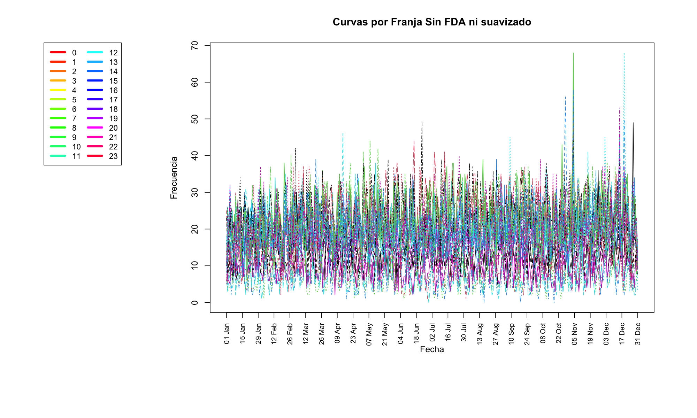
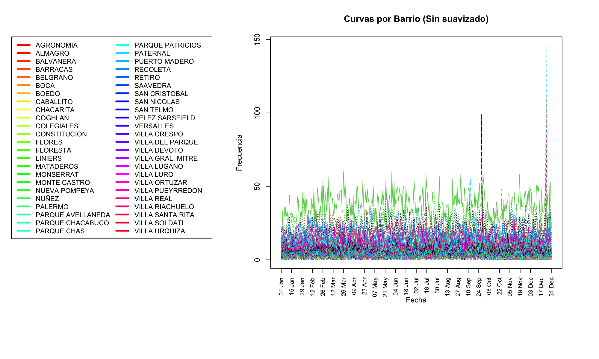
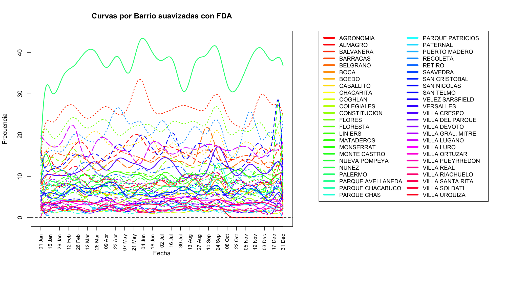

```{r}
# Instalar el paquete si no está instalado
if (!require("openxlsx")) install.packages("openxlsx")
if (!require("dplyr")) install.packages("dplyr")
# Cargar el paquete
library(dplyr)
```

# 1) Fuente de datos

## Carga el dataset


```{r}
library(openxlsx)
delitos <- read.xlsx("/Users/bquinonez/Downloads/delitos_2023.xlsx")
delitos
```

```{r}
summary(delitos)

```

```{r}
dim(delitos)
```

El dataset antes del preprocesamiento cuenta con 15 columnas y 157.461 registros correspondientes al año 2023.


# 2) Preprocesamiento

## Verificación de nulos

```{r}
colSums(is.na(delitos))
```

Tipos de Delitos

```{r}
cantidad_valores_unicos <- (unique(delitos$tipo))
print(cantidad_valores_unicos)
```

Subtipos de delitos

```{r}
conteo_por_tipo <- table(delitos$tipo)
print(conteo_por_tipo)
```

```{r}
cantidad_valores_unicos <- (unique(delitos$subtipo))
print(cantidad_valores_unicos)
conteo_por_subtipo <- table(delitos$subtipo)
print(conteo_por_subtipo)
```

## Creación de variables

Agregamos la columna de franja horaria

```{r}
library(dplyr)
#Genero la columna franja(horaria)
delitos <- delitos %>%
  mutate(
    franja_horaria = case_when(
      franja >= 6 & franja < 12 ~ "Mañana",
      franja >= 12 & franja < 18 ~ "Tarde",
      franja >= 18 & franja < 24 ~ "Noche",
      franja >= 0 & franja < 6  ~ "Madrugada",
      TRUE ~ "Desconocido" # Para casos fuera de rango 
    )
  )
delitos
```

Agregamos una columna que indica si es fin de semana o día de semana

```{r}
delitos$tipo_dia <- ifelse(delitos$dia %in% c("SAB", "DOM"),
                                             "Fin de semana", "Día de semana")
delitos
```

Agregamos una columna que indica la estación del año

```{r}
# Crear columna 'estacion' basada en el mes
delitos <- delitos %>%
  mutate(
    estacion = case_when(
      mes %in% c("diciembre", "enero", "febrero") ~ "Verano",
      mes %in% c("marzo", "abril", "mayo")       ~ "Otoño",
      mes %in% c("junio", "julio", "agosto")     ~ "Invierno",
      mes %in% c("septiembre", "octubre", "noviembre") ~ "Primavera",
      TRUE ~ "Desconocido" # Para casos no esperados
    )
  )
delitos
```

Conversión de longitud y latitud

```{r}
# Convertir longitud y latitud a numéricas y escalarlas correctamente
delitos <- delitos %>%
  mutate(
    longitud = as.numeric(longitud) / 1e6,  # Escalar dividiendo entre 10^6
    latitud = as.numeric(latitud) / 1e6    # Escalar dividiendo entre 10^6
  )

# Verificar las primeras filas para confirmar
head(delitos[c("longitud", "latitud")])
```

Eliminación de nulos y barrios que no forman parte de CABA dado que no es una cantidad que afecte el análisis.

```{r}
library(stringr)
delitos <- na.omit(delitos)
dim(delitos)

# Filtrar y renombrar barrios
delitos <- delitos %>%
  filter(!barrio %in% c("0", "Sin geo", "NULL", "NO ESPECIFICADA", 
                        "GREGORIO DE LAFERRERE", "BANFIELD OESTE", 
                        "BERNAL", "DOCK SUD", "SANTA MARÍA", 
                        "VILLA LUZURIAGA", "SD", "CASEROS", "AV BOEDO", "RODRIGO BUENO")) %>%
  mutate(
    barrio = str_replace_all(barrio, "NUNEZ", "NUÑEZ"),
    barrio = str_replace_all(barrio, "LA BOCA", "BOCA"),
    barrio = str_replace_all(barrio, "CONTITUCIÓN", "CONSTITUCION"),
    barrio = str_replace_all(barrio, "CONTITUCION", "CONSTITUCION"),
    barrio = str_replace_all(barrio, "CONSTITUCIÓN", "CONSTITUCION")
  )

```

Luego de la limpieza quedaron un total de 155505 y 18 atributos, ya que agregamos 3 variables adicionales: franja_horaria, dia y estacion

## Gráficos exploratorios

### Distribución de Delitos por Tipo y Mes
```{r}
library(ggplot2)
library(dplyr)

# Agrupar los datos
delitos_agrupados_tipo <- delitos %>%
  group_by(mes, tipo) %>%
  summarise(total = n(), .groups = "drop")

# Crear el gráfico sin números
grafico_apilado <- ggplot(delitos_agrupados_tipo, aes(x = mes, y = total, fill = tipo)) +
  geom_bar(stat = "identity", position = "stack") +
  facet_wrap(~ tipo, scales = "free_y") +  # Dividir por tipo de delito
  labs(
    title = "Distribución de Delitos por Tipo y Mes",
    x = "Mes",
    y = "Número de Delitos"
  ) +
  theme_minimal(base_size = 14) +
  theme(
    axis.text.x = element_text(angle = 45, hjust = 1),
    legend.position = "bottom",
    strip.text = element_text(size = 12),  # Tamaño del título de cada faceta
    plot.title = element_text(hjust = 0.5),  # Centrar el título
    legend.text = element_text(size = 10),  # Ajustar tamaño de texto de la leyenda
    legend.key.size = unit(0.8, "cm")  # Tamaño de las cajas de la leyenda
  ) +
  scale_fill_brewer(palette = "Set3")  # Paleta de colores diferenciados

# Mostrar el gráfico
print(grafico_apilado)

```

### Distribución de Delitos por Tipo y Franja Horaria

```{r}
library(ggplot2)
library(dplyr)

# Agrupar los datos por franja horaria, tipo y subtipo
delitos_agrupados_horario <- delitos %>%
  group_by(franja, tipo) %>%
  summarise(total = n(), .groups = "drop")

# Crear el gráfico apilado por franja horaria
grafico_horarios <- ggplot(delitos_agrupados_horario, aes(x = franja, y = total, fill = tipo)) +
  geom_bar(stat = "identity", position = "stack") +
  facet_wrap(~ tipo, scales = "free_y") +  # Dividir por tipo de delito
  labs(
    title = "Distribución de Delitos por Tipo y Franja Horaria",
    x = "Franja Horaria",
    y = "Número de Delitos"
  ) +
  theme_minimal(base_size = 14) +
  theme(
    axis.text.x = element_text(angle = 45, hjust = 1),
    legend.position = "bottom",
    strip.text = element_text(size = 12),  # Tamaño del título de cada faceta
    plot.title = element_text(hjust = 0.5),  # Centrar el título
    legend.text = element_text(size = 10),  # Ajustar tamaño de texto de la leyenda
    legend.key.size = unit(0.8, "cm")  # Tamaño de las cajas de la leyenda
  ) +
  scale_fill_brewer(palette = "Set3")  # Paleta de colores diferenciados

# Mostrar el gráfico
print(grafico_horarios)

```
```{r}
library(ggplot2)
library(dplyr)

# Agrupar los datos por franja horaria
delitos_por_hora <- delitos %>%
  group_by(franja) %>%
  summarise(total = n(), .groups = "drop")

# Crear el gráfico de barras
grafico_horas <- ggplot(delitos_por_hora, aes(x = franja, y = total)) +
  geom_bar(stat = "identity", fill = "steelblue", color = "black", width = 0.7) +
  labs(
    title = "Distribución de Delitos por Hora",
    x = "Hora del Día",
    y = "Número de Delitos"
  ) +
  theme_minimal(base_size = 14) +
  theme(
    axis.text.x = element_text(angle = 45, hjust = 1),
    plot.title = element_text(hjust = 0.5),
    panel.grid.major = element_line(size = 0.5, linetype = "dotted"),
    panel.grid.minor = element_blank()
  )

# Mostrar el gráfico
print(grafico_horas)

```


## Transformación de variables categóricas

Transformamos todos los caracteres a numéricos, exceptuando moto,arma,lat,long

```{r}
library(dplyr)

# Convertir columnas específicas `uso_arma` y `uso_moto` (Sí=1, No=0)
del <- delitos %>%
  mutate(
    uso_arma = ifelse(uso_arma == "SI", 1, 0),
    uso_moto = ifelse(uso_moto == "SI", 1, 0)
  )

# Convertir otras columnas categóricas a nuevas columnas codificadas
del <- del %>%
  mutate(across(
    .cols = where(is.character) & !all_of(c("longitud", "latitud", "uso_arma", "uso_moto")), 
    .fns = ~ as.numeric(as.factor(.)),
    .names = "{.col}_cod"
  )) %>%
  mutate(across(
    .cols = where(is.factor) & !all_of(c("longitud", "latitud", "uso_arma", "uso_moto")), 
    .fns = ~ as.numeric(.),
    .names = "{.col}_cod"
  ))

# Verificar la estructura del dataset después de las transformaciones
str(del)

```

### Evolución Temporal de Delitos por Tipo

```{r}
library(ggplot2)
library(dplyr)

# Agrupación por año, mes y tipo de delito
delitos_temporal <- del %>%
  group_by(anio, mes_cod, tipo) %>%
  summarise(total_delitos = n(), .groups = "drop")

# Visualización de la evolución
ggplot(delitos_temporal, aes(x = mes_cod, y = total_delitos, color = tipo, group = tipo)) +
  geom_line(size = 1) +
  scale_x_continuous(breaks = 1:12, labels = month.abb) +
  labs(title = "Evolución Temporal de Delitos por Tipo por mes",
       x = "Mes",
       y = "Número de Delitos",
       color = "Tipo de Delito") +
  theme_minimal()

```

### Evolución Temporal de Delitos por Tipo
```{r}
delitos_temporal_h <- del %>%
  group_by(franja, tipo) %>%
  summarise(total_delitos = n(), .groups = "drop")

delitos_temporal_h$franja <- as.character(delitos_temporal_h$franja)


ggplot(delitos_temporal_h, aes(x = franja, y = total_delitos, color = tipo, group = tipo)) +
  geom_line(size = 1) +
  labs(title = "Evolución Temporal de Delitos por Tipo y franja horaria",
       x = "Franja Horaria",
       y = "Número de Delitos",
       color = "Tipo de Delito") +
  theme_minimal()


```


### Frecuencia de Delitos por Barrio y Tipo 
```{r}
library(ggplot2)
library(dplyr)

# Agrupar los datos por barrio y calcular el total de delitos por barrio
delitos_por_barrio <- delitos %>%
  group_by(barrio) %>%
  summarise(total_delitos = n(), .groups = "drop") %>%
  mutate(barrio = reorder(barrio, -total_delitos))  # Ordenar barrios por número de delitos

# Filtrar los 15 barrios con más delitos
top_barrios <- delitos_por_barrio

# Crear el gráfico de barras
ggplot(top_barrios, aes(x = barrio, y = total_delitos)) +
  geom_bar(stat = "identity", fill = "steelblue") +  # Color sólido para las barras
  labs(
    title = "Frecuencia Total de Delitos por Barrio",
    x = "Barrio",
    y = "Número de Delitos"
  ) +
  theme_minimal() +
  theme(
    axis.text.x = element_text(angle = 90, vjust = 0.5, hjust = 1),  # Rotar etiquetas a 90 grados
    plot.title = element_text(hjust = 0.5)  # Centrar el título
  )

# Guardar el gráfico con dimensiones mayores
ggsave("grafico_delitos_totales_barrio.png", width = 12, height = 8, dpi = 300)


```

### Dia de semana vs Finde
```{r}
# Agrupar los datos por día de la semana
delitos_por_dia <- delitos %>%
  group_by(tipo_dia) %>%
  summarise(total = n(), .groups = "drop")

# Crear el gráfico de barras
ggplot(delitos_por_dia, aes(x = tipo_dia, y = total, fill = tipo_dia)) +
  geom_bar(stat = "identity", width = 0.7) +
  labs(
    title = "Frecuencia de Delitos por Día de la Semana",
    x = "Día de la Semana",
    y = "Número de Delitos"
  ) +
  theme_minimal() +
  theme(
    plot.title = element_text(hjust = 0.5),  # Centrar el título
    axis.text.x = element_text(angle = 45, hjust = 1)  # Rotar etiquetas si es necesario
  ) +
  scale_fill_brewer(palette = "Set3")  # Paleta de colores


```
### Frecuencia de Delitos por Estación del Año
```{r}
# Agrupar los datos por estación
delitos_por_estacion <- delitos %>%
  group_by(estacion) %>%
  summarise(total = n(), .groups = "drop")

# Crear el gráfico de barras
ggplot(delitos_por_estacion, aes(x = estacion, y = total, fill = estacion)) +
  geom_bar(stat = "identity") +
  labs(
    title = "Frecuencia de Delitos por Estación del Año",
    x = "Estación",
    y = "Número de Delitos"
  ) +
  theme_minimal()

```


# 3) Aplicación de FDA

## A) Frencuencia de delitos agrupados por franja (24) y fecha

```{r}
# Cargar librerías necesarias
if (!require("RColorBrewer")) install.packages("RColorBrewer")
library(RColorBrewer)
library(dplyr)
library(tidyr)
library(fda.usc)
library(fda)
library(ggplot2)
library(ggrepel)
library(tibble)  # Para usar column_to_rownames


# Agrupar por día y horario, y contar la frecuencia de delitos
delitos_por_dia_horario <- delitos %>%
  group_by(franja, fecha) %>%  # 'franja_horaria' representa los horarios
  summarise(frecuencia = sum(cantidad, na.rm = TRUE), .groups = "drop")

# Crear una matriz con filas como días y columnas como franjas horarias
delitos_franja_matrix <- delitos_por_dia_horario %>%
  pivot_wider(names_from = fecha, values_from = frecuencia, values_fill = 0) %>%
  column_to_rownames(var = "franja") %>%
  as.matrix()

delitos_franja_matrix <- delitos_franja_matrix[complete.cases(delitos_franja_matrix), ]

```

### a) SIN FDA: Creamos las curvas por franja a lo largo del 2023 sin FDA.

```{r}

# Crear un vector de fechas reales
fechas_date <- seq.Date(from = as.Date("2023-01-01"), by = "day", length.out = ncol(delitos_franja_matrix))

# Crear colores únicos para cada barrio
colores <- rainbow(nrow(delitos_franja_matrix))


# Crear el gráfico con dimensiones ampliadas
png("grafico_franjas_sin_fda.png", width = 2000, height = 1200, res = 150)  # Resolución más alta

# Ajustar márgenes: más espacio derecho para la leyenda
par(mar = c(10, 35, 4, 4) + 0.1)  # Aumentar margen izquierdo

# Graficar las curvas originales
matplot(fechas_date, t(delitos_franja_matrix), type = "l", lty = 1, col = colores, lwd = 2,
        xlab = "Fecha", ylab = "Frecuencia", xaxt = "n",
        main = "Curvas por Franja (Sin suavizado)")

# Crear etiquetas de fechas en el eje X
fechas_etiquetas <- seq(min(fechas_date), max(fechas_date), by = "2 weeks")  # Mostrar cada dos semanas
axis(1,
     at = as.numeric(fechas_etiquetas),  # Usar fechas reales como índices
     labels = format(fechas_etiquetas, "%d %b"),  # Día y mes
     las = 2,  # Rotar las etiquetas
     cex.axis = 0.8)  # Tamaño del texto en el eje Xpe

# Crear una leyenda más amplia en el margen izquierdo
legend("topright",
       inset = c(1.2, 0),   # Más espacio hacia la izquierda
       rownames(delitos_franja_matrix),
       col = colores,
       lty = 1,
       lwd = 4,  # Grosor de las líneas
       ncol = 2,  # Dividir la leyenda en dos columnas
       cex = 0.9,  # Tamaño del texto más grande
       xpd = TRUE)  # Permitir que la leyenda esté fuera del área de dibujo

# Guardar y cerrar el archivo PNG
dev.off()

# Verificar que el archivo fue creado
browseURL("grafico_franjas_sin_fda.png")
```


### b) CON FDA: Creamos las curvas por franja a lo largo del 2023 con FDA.

```{r}
# Paso 2: Representar Datos como Curvas Funcionales con Suavizado

# Crear una base B-spline penalizada para suavizar las funciones
nbasis <- 25  # Ajusta el número de bases para mayor flexibilidad
lambda <- 1e-2  # Parámetro de suavizado; menor valor = más suave

# Crear la base B-spline
basis <- create.bspline.basis(rangeval = range(fechas_date), nbasis = nbasis)

# Definir el objeto de parámetros funcionales con suavizado
fd_par <- fdPar(basis, Lfdobj = int2Lfd(2), lambda = lambda)

# Convertir las filas de la matriz en funciones continuas suavizadas
fd_obj_suavizado <- smooth.basis(fechas_date, t(delitos_franja_matrix), fd_par)$fd

# Visualizar las funciones suavizadas por barrio antes del clustering
colores <- rainbow(nrow(delitos_franja_matrix))  # Generar colores únicos para cada barrio

# Crear el gráfico con dimensiones ampliadas
png("grafico_franjas_con_fda.png", width = 2000, height = 1200, res = 150)  # Resolución más alta

# Ajustar márgenes: más espacio derecho para la leyenda
par(mar = c(10, 4, 4, 35) + 0.1)  # Aumentar margen derecho para que la leyenda no quede cortada

# Graficar las funciones suavizadas
plot(fd_obj_suavizado, main = "Curvas por Franja suavizadas con FDA",
     xlab = "Fecha", ylab = "Frecuencia",
     col = colores,
     lwd = 2, xaxt = "n")  # Desactivar eje X predeterminado

# Crear etiquetas de fechas en el eje X
fechas_etiquetas <- seq(min(fechas_date), max(fechas_date), by = "2 weeks")  # Mostrar cada dos semanas
axis(1,
     at = as.numeric(fechas_etiquetas),  # Usar fechas reales como índices
     labels = format(fechas_etiquetas, "%d %b"),  # Día y mes
     las = 2,  # Rotar las etiquetas
     cex.axis = 0.8)  # Tamaño del texto en el eje X

# Crear una leyenda ajustada en el lado derecho del gráfico
legend("topleft",
       inset = c(1.1, 0),  # Reducir el espacio hacia la derecha
       legend = rownames(delitos_franja_matrix),
       col = colores,
       lty = 1,
       lwd = 4,  # Grosor de las líneas
       ncol = 2,  # Dividir la leyenda en dos columnas
       cex = 0.9,  # Tamaño del texto ajustado
       xpd = TRUE)  # Permitir que la leyenda esté fuera del área de dibujo


# Guardar y cerrar el archivo PNG
dev.off()

# Verificar que el archivo fue creado
browseURL("grafico_franjas_con_fda.png")

```


## B) Frencuencia de delitos agrupados por barrio (48) y fecha

Armamos la agrupación por barrio y fecha y creamos la matriz funcinal con barrios como filas y fechas como columnas

```{r}
# Cargar librerías necesarias
if (!require("RColorBrewer")) install.packages("RColorBrewer")
library(RColorBrewer)
library(dplyr)
library(tidyr)
library(fda.usc)
library(fda)
library(ggplot2)
library(ggrepel)
library(tibble)  # Para usar column_to_rownames

# Paso 1: Agrupar datos y preparar la matriz funcional
# Agrupar por barrio y fecha, sumando la frecuencia de delitos
delitos_agrupados_barrio <- delitos %>%
  group_by(barrio, fecha) %>%
  summarise(frecuencia_diaria = sum(cantidad, na.rm = TRUE), .groups = "drop")

# Crear matriz funcional: barrios como filas, fechas como columnas
delitos_matrix <- delitos_agrupados_barrio %>%
  pivot_wider(names_from = fecha, values_from = frecuencia_diaria, values_fill = 0) %>%
  column_to_rownames(var = "barrio") %>%
  as.matrix()

# Eliminar filas con valores faltantes y verificar la variabilidad
delitos_matrix <- delitos_matrix[complete.cases(delitos_matrix), ]
variabilidad <- apply(delitos_matrix, 1, var, na.rm = TRUE)
delitos_matrix <- delitos_matrix[variabilidad > 0.01, ]


```

### a) SIN FDA: Creamos las curvas por barrio a lo largo del 2023 sin FDA.

```{r}

# Crear un vector de fechas reales
fechas_date <- seq.Date(from = as.Date("2023-01-01"), by = "day", length.out = ncol(delitos_matrix))

# Graficar curvas originales por barrio sin aplicar FDA
# Crear el gráfico con dimensiones ampliadas
png("grafico_barrios_sin_fda.png", width = 2000, height = 1200, res = 150)  # Resolución más alta

# Ajustar márgenes: más espacio izquierdo para la leyenda
par(mar = c(10, 35, 4, 4) + 0.1)  # Aumentar margen izquierdo

# Crear colores únicos para cada barrio
colores <- rainbow(nrow(delitos_matrix))

# Graficar las curvas originales
matplot(fechas_date, t(delitos_matrix), type = "l", lty = 1, col = colores, lwd = 2,
        xlab = "Fecha", ylab = "Frecuencia", xaxt = "n",
        main = "Curvas por Barrio (Sin suavizado)")

# Crear etiquetas de fechas en el eje X
fechas_etiquetas <- seq(min(fechas_date), max(fechas_date), by = "2 weeks")  # Mostrar cada dos semanas
axis(1,
     at = as.numeric(fechas_etiquetas),  # Usar fechas reales como índices
     labels = format(fechas_etiquetas, "%d %b"),  # Día y mes
     las = 2,  # Rotar las etiquetas
     cex.axis = 0.8)  # Tamaño del texto en el eje Xpe

# Crear una leyenda más amplia en el margen izquierdo
legend("topright",
       inset = c(1.2, 0),   # Más espacio hacia la izquierda
       rownames(delitos_matrix),
       col = colores,
       lty = 1,
       lwd = 4,  # Grosor de las líneas
       ncol = 2,  # Dividir la leyenda en dos columnas
       cex = 0.9,  # Tamaño del texto más grande
       xpd = TRUE)  # Permitir que la leyenda esté fuera del área de dibujo

# Guardar y cerrar el archivo PNG
dev.off()

# Verificar que el archivo fue creado
browseURL("grafico_barrios_sin_fda.png")

```



#### Graficamos el método de codo y silhouette para definir el número de clusters

```{r}
dim(delitos_matrix)  # Deberías ver (n_barrio, n_fechas)

delitos_matrix_normalized <- scale(delitos_matrix)

library(factoextra)

# Método del codo para determinar el número óptimo de clusters
fviz_nbclust(delitos_matrix_normalized, kmeans, method = "wss") +
  labs(title = "Método del Codo")

fviz_nbclust(delitos_matrix_normalized, kmeans, method = "silhouette") +
  labs(title = "Índice de Silhouette")

```

```{r}
set.seed(123)  # Para reproducibilidad
num_clusters <- 2  # Cambia según los resultados del método del codo o Silhouette

kmeans_result <- kmeans(delitos_matrix_normalized, centers = num_clusters, nstart = 20)

clusters <- data.frame(
  barrio = rownames(delitos_matrix),
  cluster = kmeans_result$cluster
)

# Ordenar el dataframe por cluster
clusters_ordenados <- clusters %>%
  arrange(cluster)


# Ver los primeros resultados
print(clusters_ordenados)


```

Usamos PCA para graficar los clusters

```{r}

library(ggplot2)
library(dplyr)

# Calcular la cantidad de barrios por cluster
cluster_sizes <- clusters %>%
  group_by(cluster) %>%
  summarise(n_barrios = n()) %>%
  mutate(cluster_label = paste0("Cluster ", cluster, " (n=", n_barrios, ")"))

# Calcular PCA en la matriz normalizada
pca_result <- prcomp(delitos_matrix_normalized, center = TRUE, scale. = TRUE)
pca_data <- as.data.frame(pca_result$x[, 1:2])  # Tomar las dos primeras componentes
pca_data$cluster <- as.factor(clusters$cluster)  # Convertir a factor

cluster_sizes$cluster <- as.factor(cluster_sizes$cluster)  # Convertir a factor

# Combinar con las etiquetas personalizadas
pca_data <- pca_data %>%
  left_join(cluster_sizes, by = "cluster")

# Graficar PCA con leyenda personalizada
ggplot(pca_data, aes(x = PC1, y = PC2, color = cluster_label)) +
  geom_point(size = 3, alpha = 0.7) +  # Puntos para los barrios
  theme_minimal() +
  labs(
    title = "Clusters Visualizados en el Espacio PCA",
    x = "PC1",
    y = "PC2",
    color = "Cluster"
  ) +
  theme(legend.position = "bottom")


```

```{r}
delitos_df <- as.data.frame(delitos_matrix) %>%
  rownames_to_column(var = "barrio")  # Convertir rownames en columna llamada 'barrio'
resumen_clusters <- clusters %>%
  left_join(delitos_df, by = "barrio") %>%  # 'barrio' ya es una columna explícita
  group_by(cluster) %>%
  summarise_all(mean, na.rm = TRUE)

print(resumen_clusters)

```

#### Aplicamos silhouette para validar los clusters

```{r}
library(cluster)

# Calcular índice de Silhouette
silhouette_result <- silhouette(kmeans_result$cluster, dist(delitos_matrix_normalized))

# Resumen del índice de Silhouette
summary(silhouette_result)

# Inspeccionar los valores del índice de Silhouette
head(silhouette_result[, 1:3])  # Cluster, vecino más cercano, valor de Silhouette

# Promedio del índice
mean(silhouette_result[, 3])

# Visualizar índice de Silhouette
fviz_silhouette(silhouette_result) +
  labs(title = "Índice de Silhouette por Cluster",
       x = "Índice de Silhouette",
       y = "Barrios")

```


### b) CON FDA: Creamos las curvas por barrio a lo largo del 2023 con FDA.

```{r}

# Paso 2: Representar Datos como Curvas Funcionales con Suavizado

# Crear una base B-spline penalizada para suavizar las funciones
nbasis <- 25  # Ajusta el número de bases para mayor flexibilidad
lambda <- 1e-2  # Parámetro de suavizado; menor valor = más suave

# Crear la base B-spline
basis <- create.bspline.basis(rangeval = range(fechas_date), nbasis = nbasis)

# Definir el objeto de parámetros funcionales con suavizado
fd_par <- fdPar(basis, Lfdobj = int2Lfd(2), lambda = lambda)

# Convertir las filas de la matriz en funciones continuas suavizadas
fd_obj_suavizado <- smooth.basis(fechas_date, t(delitos_matrix), fd_par)$fd

# Visualizar las funciones suavizadas por barrio antes del clustering
colores <- rainbow(nrow(delitos_matrix))  # Generar colores únicos para cada barrio

# Crear el gráfico con dimensiones ampliadas
png("grafico_barrios_con_fda.png", width = 2000, height = 1200, res = 150)  # Resolución más alta

# Ajustar márgenes: más espacio derecho para la leyenda
par(mar = c(10, 4, 4, 35) + 0.1)  # Aumentar margen derecho para que la leyenda no quede cortada

# Graficar las funciones suavizadas
plot(fd_obj_suavizado, main = "Curvas por Barrio suavizadas con FDA",
     xlab = "Fecha", ylab = "Frecuencia",
     col = colores,
     lwd = 2, xaxt = "n")  # Desactivar eje X predeterminado

# Crear etiquetas de fechas en el eje X
fechas_etiquetas <- seq(min(fechas_date), max(fechas_date), by = "2 weeks")  # Mostrar cada dos semanas
axis(1,
     at = as.numeric(fechas_etiquetas),  # Usar fechas reales como índices
     labels = format(fechas_etiquetas, "%d %b"),  # Día y mes
     las = 2,  # Rotar las etiquetas
     cex.axis = 0.8)  # Tamaño del texto en el eje X

# Crear una leyenda ajustada en el lado derecho del gráfico
legend("topleft",
       inset = c(1.1, 0),  # Reducir el espacio hacia la derecha
       legend = rownames(delitos_matrix),
       col = colores,
       lty = 1,
       lwd = 4,  # Grosor de las líneas
       ncol = 2,  # Dividir la leyenda en dos columnas
       cex = 0.9,  # Tamaño del texto ajustado
       xpd = TRUE)  # Permitir que la leyenda esté fuera del área de dibujo


# Guardar y cerrar el archivo PNG
dev.off()

# Verificar que el archivo fue creado
browseURL("grafico_barrios_con_fda.png")

# Paso 3: Clustering Funcional con K-Means
# Determinar el número óptimo de clusters con el método del codo
set.seed(123)
wss <- sapply(2:10, function(k) {
  kmeans(fd_obj_suavizado$coefs, centers = k, nstart = 20)$tot.withinss
})

```



#### Graficamos el método de codo y silhouette para definir el número de clusters

```{r}
# Graficar el método del codo
plot(2:10, wss, type = "b", pch = 19, frame = FALSE,
     xlab = "Número de Clusters", ylab = "Suma de Errores al Cuadrado (WSS)",
     main = "Método del Codo para Clustering Funcional")

# Elegir un número de clusters (por ejemplo, 3)
num_clusters <- 2
kmeans_result <- kmeans(fd_obj_suavizado$coefs, centers = num_clusters, nstart = 20)

fviz_nbclust(fd_obj_suavizado$coefs, kmeans, method = "silhouette") +
  labs(title = "Índice de Silhouette")
```

#### Definimos los clusters correspondientes

```{r}

fd_transposed <- t(fd_obj_suavizado$coefs)

# Aplicar kmeans funcional con manejo de clusters pequeños
num_clusters <- 2  # Cambiar según necesidad

# Aplicar clustering funcional
kmeans_result <- kmeans(t(fd_obj_suavizado$coefs), centers = num_clusters, nstart = 20)

```

#### Graficamos los clusters 


```{r}

# Asignar clusters a los barrios
# Crear el dataframe con los barrios y los clusters asignados
clusters <- data.frame(
  barrio = colnames(fd_obj_suavizado$coefs),  # Nombres de los barrios
  cluster = kmeans_result$cluster               # Clusters asignados
)

# Evaluar las curvas funcionales
matriz_evaluada <- t(eval.fd(fechas_date, fd_obj_suavizado))  # Evaluar en fechas_date

# Asignar las fechas como nombres de las columnas
colnames(matriz_evaluada) <- as.character(fechas_date)  # Convertir fechas a texto


# Actualizar etiquetas de los clusters con los tamaños
df_curves <- as.data.frame(matriz_evaluada) %>%
  rownames_to_column("barrio") %>%
  pivot_longer(-barrio, names_to = "fecha", values_to = "frecuencia") %>%
  mutate(
    fecha = as.Date(fecha),  # Convertir texto a objeto Date
    cluster = factor(clusters$cluster[match(barrio, clusters$barrio)])
  )


# Calcular cantidad de barrios únicos por cluster
cluster_sizes <- df_curves %>%
  group_by(cluster) %>%
  summarise(n_barrios = n_distinct(barrio))  # Contar barrios únicos

df_curves <- df_curves %>%
  left_join(cluster_sizes, by = "cluster") %>%  # Agregar tamaños al dataframe
  mutate(cluster_label = paste0("Cluster ", cluster, " (n=", n_barrios, ")"))  # Etiquetas personalizadas


ggplot(df_curves, aes(x = fecha, y = frecuencia, group = barrio, color = cluster_label)) +
  geom_line(alpha = 0.7) +
  theme_minimal() +
  labs(
    title = "Clustering Funcional por Barrio",
    x = "Fecha",
    y = "Frecuencia",
    color = "Cluster"
  ) +
  theme(legend.position = "bottom")


# Crear la tabla con los barrios por cluster
tabla_barrios <- df_curves %>%
  dplyr::select(barrio, cluster_label) %>%  # Seleccionar columnas necesarias
  distinct() %>%                     # Eliminar duplicados
  arrange(cluster_label, barrio)     # Ordenar por cluster y barrio

print(tabla_barrios)

```

#### Graficamos las curvas promedios por cluster 

```{r}
# Calcular la frecuencia promedio por cluster y fecha
df_avg <- df_curves %>%
  group_by(cluster_label, fecha) %>%
  summarise(frecuencia_promedio = mean(frecuencia), .groups = "drop")

ggplot() +
  # Curvas individuales
  geom_line(data = df_curves, aes(x = fecha, y = frecuencia, group = barrio, color = cluster_label), alpha = 0.4) +
  # Curvas promedio por cluster
  geom_line(data = df_avg, aes(x = fecha, y = frecuencia_promedio, group = cluster_label, color = cluster_label), size = 1.5) +
  theme_minimal() +
  labs(
    title = "Clustering Funcional por Barrio con Curvas Promedio",
    x = "Fecha",
    y = "Frecuencia",
    color = "Cluster"
  ) +
  theme(legend.position = "bottom")

```

#### Validación de clusters con Silhouette

```{r}
if (!require("cluster")) install.packages("cluster")
if (!require("factoextra")) install.packages("factoextra")
library(cluster)
library(factoextra)

# Asegurar que los clusters coinciden con la matriz
clusters <- df_curves %>%
  distinct(barrio, cluster) %>%
  arrange(barrio)  # Ordenar por barrio para garantizar coincidencia

# Calcular la matriz de distancias
matriz_clustering <- matriz_evaluada[order(rownames(matriz_evaluada)), ]  # Ordenar filas por nombre de barrio

# Calcular el índice de Silhouette
silhouette_result <- silhouette(as.numeric(clusters$cluster), dist(matriz_clustering))

# Resumen del índice de Silhouette
summary(silhouette_result)

# Inspeccionar los valores del índice de Silhouette
head(silhouette_result[, 1:3])  # Cluster, vecino más cercano, valor de Silhouette

# Promedio del índice
mean(silhouette_result[, 3])

# Visualizar Silhouette
fviz_silhouette(silhouette_result) +
  labs(title = "Índice de Silhouette por Cluster",
       x = "Índice de Silhouette",
       y = "Barrios") +
  theme_minimal()


```


### c) PCA Funcional: También aplicamos PCA a los coeficientes funcionales y luego calculamos los clusters

```{r}

# Paso 2: Extraer los coeficientes funcionales
coeficientes <- t(fd_obj_suavizado$coefs)

# Paso 3: Aplicar PCA a los coeficientes funcionales
pca_result <- prcomp(coeficientes, center = TRUE, scale. = TRUE)  # Normalizar para PCA

# Explorar la varianza explicada por las componentes principales
varianza_explicada <- cumsum(pca_result$sdev^2) / sum(pca_result$sdev^2) * 100
print(varianza_explicada)  # Ver proporción de varianza explicada

# Elegir el número de componentes principales
num_componentes <- 2  # Cambiar según necesidad (e.g., varianza explicada > 80%)
scores_pca <- pca_result$x[, 1:num_componentes]  # Tomar los scores de las componentes seleccionadas


# Paso 4: Aplicar k-means usando los scores de PCA
set.seed(123)  # Para reproducibilidad
num_clusters <- 2  # Cambiar según necesidad
kmeans_result <- kmeans(scores_pca, centers = num_clusters, nstart = 20)

# Ver los clusters asignados
clusters <- data.frame(
  barrio = colnames(fd_obj_suavizado$coefs),
  cluster = kmeans_result$cluster
)

# Ordenar el dataframe por cluster
clusters_ordenados <- clusters %>%
  arrange(cluster)


# Ver los primeros resultados
print(clusters_ordenados)

library(ggplot2)

# Crear un dataframe con las dos primeras componentes principales y los clusters
df_pca <- as.data.frame(scores_pca)  # Convertir los scores seleccionados a dataframe
df_pca$cluster <- as.factor(kmeans_result$cluster)  # Agregar los clusters asignados
df_pca$barrio <- colnames(fd_obj_suavizado$coefs)  # Agregar nombres de los barrios

library(ggplot2)
library(dplyr)

# Calcular la cantidad de barrios por cluster
cluster_sizes <- df_pca %>%
  group_by(cluster) %>%
  summarise(n_barrios = n())  # Contar barrios por cluster

# Crear etiquetas personalizadas para la leyenda
cluster_labels <- cluster_sizes %>%
  mutate(cluster_label = paste0("Cluster ", cluster, " (n=", n_barrios, ")")) %>%
  pull(cluster_label)  # Extraer etiquetas como vector

# Mapear las etiquetas a los clusters
names(cluster_labels) <- cluster_sizes$cluster  # Asignar etiquetas por número de cluster

# Graficar los clusters en el espacio PCA con las etiquetas personalizadas
ggplot(df_pca, aes(x = PC1, y = PC2, color = cluster)) +
  geom_point(size = 3, alpha = 0.7) +  # Representar los puntos
  theme_minimal() +
  labs(
    title = "Clusters Visualizados en el Espacio PCA",
    x = "Componente Principal 1",
    y = "Componente Principal 2",
    color = "Cluster"
  ) +
  theme(legend.position = "bottom") +
  scale_color_manual(
    values = c("#1b9e77", "#d95f02", "#7570b3", "#e7298a"),  # Colores personalizados
    labels = cluster_labels  # Etiquetas con la cantidad de barrios
  )


```

#### Validación de clusters nuevamente con Silhouette

```{r}
library(cluster)
library(factoextra)

# Calcular la matriz de distancias usando los scores PCA
dist_pca <- dist(df_pca[, c("PC1", "PC2")])

# Calcular el índice de Silhouette
silhouette_result <- silhouette(as.numeric(df_pca$cluster), dist_pca)

# Ver un resumen del índice de Silhouette
summary(silhouette_result)


# Promedio del índice de Silhouette
silhouette_avg <- mean(silhouette_result[, 3])
print(paste("Índice de Silhouette promedio:", round(silhouette_avg, 3)))


# Visualizar el índice de Silhouette
fviz_silhouette(silhouette_result) +
  labs(
    title = "Índice de Silhouette para Clusters en PCA",
    x = "Índice de Silhouette",
    y = "Barrios"
  ) +
  theme_minimal()

```

